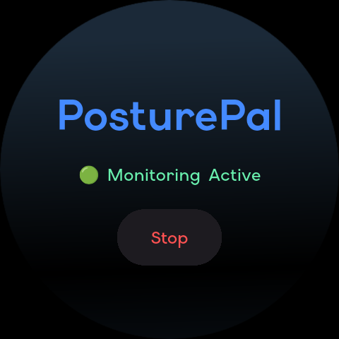
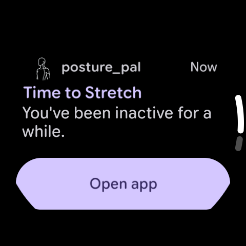
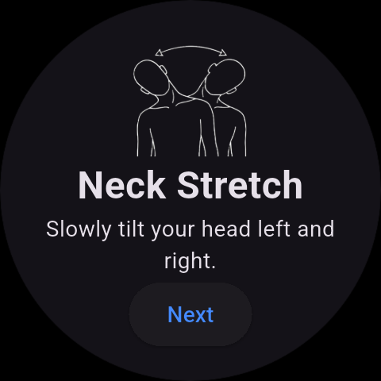

# PosturePal

A Wear OS posture reminder application that helps users avoid long periods of inactivity by monitoring wrist movement and sending stretch reminders.

## Features

* Background posture monitoring using Wear OS sensors
* Inactivity detection using accelerometer data
* Foreground service for continuous monitoring
* Stretch reminder notifications
* Direct navigation to guided stretch exercises
* Start/Stop monitoring controls
* Real-time sitting time tracking
* Lightweight and battery-conscious design
* Optimized for Wear OS smartwatches

## Screenshots

*Add screenshots here*

| Dashboard  | Reminder   | Stretch Session |
| ---------- | ---------- | --------------- |
|  |  |  |

---

## How It Works

1. User starts monitoring.
2. The app runs a foreground service in the background.
3. Accelerometer data is used to detect wrist movement.
4. If the user remains inactive for a configured duration, a reminder notification is triggered.
5. Tapping the notification opens a guided stretch session.
6. After completing the stretches, the user returns to the dashboard.

---

## Tech Stack

### Frontend

* Flutter
* Riverpod

### Platform

* Wear OS
* Android Foreground Services

### Sensors

* Accelerometer
* SensorManager API

### Notifications

* Android Notification Channels
* Foreground Service Notifications

---

## Project Structure

```text
lib/
├── core/
│   ├── models/
│   ├── providers/
│   └── services/
│
├── features/
│   ├── dashboard/
│   └── stretch/
│
└── main.dart
```

---

## Installation

### Clone the Repository

```bash
git clone https://github.com/your-username/posture_pal.git
cd posture_pal
```

### Install Dependencies

```bash
flutter pub get
```

### Run the Application

```bash
flutter run
```

### Build Release APK

```bash
flutter build apk --release
```

---

## Requirements

* Flutter SDK
* Android Studio
* Wear OS Emulator or Physical Wear OS Device

---

## Future Improvements

* Stretch animations using Lottie or Rive
* Daily posture statistics
* Custom reminder intervals
* Health Connect integration
* Enhanced activity analytics
* Watch face complications

---

## Motivation

Long periods of sitting can contribute to poor posture and physical discomfort. PosturePal aims to provide simple, timely reminders directly on a smartwatch, encouraging users to take short stretch breaks throughout the day.

---

## License

This project is licensed under the MIT License.
